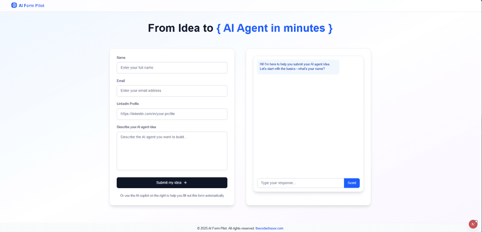
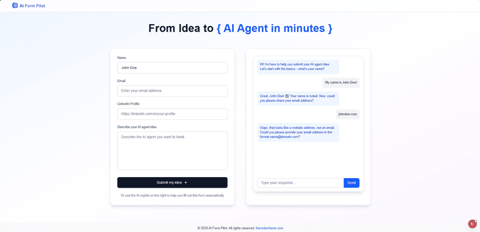
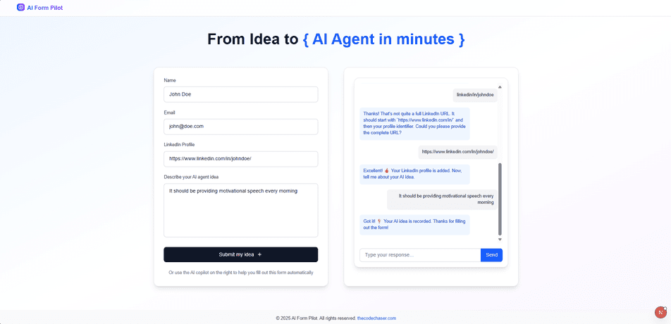

# AI Form Pilot

> AI Form Pilot is a lightweight Next app for guided form-filling. Instead of overwhelming users with fields, it asks questions one by one—like name, email, or phone—then auto-fills the form with real-time responses from the Gemini API. Users get a smooth guided flow instead of static fields, with the interactive responses from AI. Built with TypeScript and Tailwind, it’s fast, accessible, and keyboard-friendly—perfect for exploring AI-driven form experiences without extra complexity.

## Preview:







## Built With

- Gemini API
- HTML
- CSS
- JavaScript
- TypeScript
- REACT
- Next
- Tailwind CSS

## Live version

[AI Form Pilot](https://ai-form.thecodechaser.com)

## Getting Started

To get a local copy up and running follow these simple example steps.

### Prerequisites
- A text editor(preferably Visual Studio Code)
- Node
- Web browser

### Install
- [Git](https://git-scm.com/downloads)
- [Node](https://nodejs.org/en/download/)

### Using it Locally

- Clone the project

```bash 
git clone git@github.com:thecodechaser/ai-form-pilot.git

cd ai-form-pilot
```

- Install dependencies

```bash
npm i 
or
npm install
```
- To Start the development server
```bash
npm run dev
```

- To test the project
```bash
npm run test
```


## Visit And Open Files

[Visit Repo](https://github.com/thecodechaser/ai-form-pilot)

## Download Repo

[Download Repo](https://github.com/thecodechaser/ai-form-pilot/archive/refs/heads/main.zip)

## Authors

👤 **Ranjeet Singh**

- Website: [thecodechaser.com](https://thecodechaser.com)
- GitHub: [@thecodechaser](https://github.com/thecodechaser)
- Twitter: [@thecodechaser](https://twitter.com/thecodechaser)
- LinkedIn: [thecodechaser](https://linkedin.com/in/thecodechaser)

## 🤝 Contributing

Contributions, issues, and feature requests are welcome!

Feel free to check the [issues page](https://github.com/thecodechaser/ai-form-pilot/issues).

## Show your support

Give a ⭐️ if you like this project!

## Acknowledgments

- Inspiration: Canvas

## 📝 License

This project is [MIT](./LICENSE) licensed.
